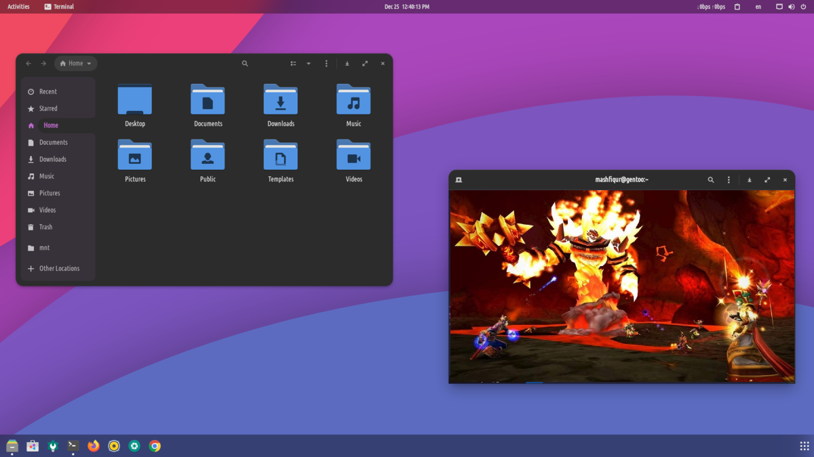
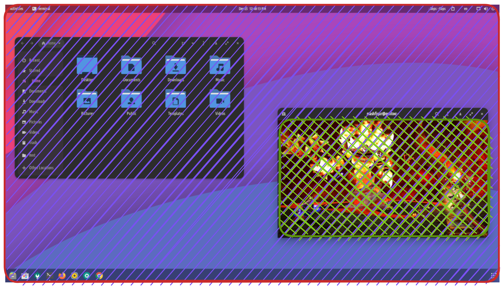

A few months ago, I wanted to stream video games from my primary residence in Barcelona to my secondary residence in Ibiza. To achieve this goal, I began learning more about Operating Systems ( OSs ) and experimenting with different software options such as [Geforce Experience](https://www.nvidia.com/en-us/geforce/geforce-experience), [Moonlight](https://moonlight-stream.org), and [Parsec](https://parsec.app).

Unfortunately, this led to compatibility issues with some of my devices because particular OS or architecture. For example, my Raspberry Pi has an ARM architecture and runs on Raspbian, while my other devices use x86 with _Windows_, _Debian_, or _Gentoo_.

Additionally, I encountered problems related to system requirements, such as the need to stream high-resolution video games with high refresh rates, such as 4k at 60/120fps, over the network. These requirements often led to memory and lag issues that were difficult to address. Memory problems can be mitigated through code optimizations or hardware upgrades, but lag is more complex.

It is often caused by a high rate of CPU utilization that exceeds the system's ability to handle continuous painting, as well as network-related issues when data needs to be sent or received remotely, and there are physical limitations in place.

To address these issues, [lossy](https://en.wikipedia.org/wiki/Lossy_compression) or [lossless](https://en.wikipedia.org/wiki/Lossless_compression) encoders/decoders such as the [H.265 codec](https://en.wikipedia.org/wiki/High_Efficiency_Video_Coding) can be used to reduce bandwidth, sometimes with hardware support. But, despite trying several different software options, these solutions are not always easily configurable through software options.

This limited configuration makes sense, as attempting to achieve all this optimally requires a change and abstraction on the part of the kernel. This would be an overly significant effort for any type of software, and would also require a high level of support for each version offered by the kernel.

However, to me, it is a fascinating project from which I can learn a great deal. My intention is to create an operating system that allows for a distributed network of machines with transparency in the typical hierarchy of files offered by Unix systems, as well as communication between each of the machines.

```mermaid
flowchart LR
    User --> Cluster

    subgraph Cluster
        Machine1
        Machine2
        MachineN
    end
```

# Real-life situation: Playing _World of Warcraft ( WoW )_

There are situations where it is advantageous to use remote systems to process resource-intensive programs such as videogames. This is especially true when using devices like laptops or Raspberry Pis, which may not have the processing power to run such programs.

For instance, a device may be capable of handling tasks related to a _Desktop Environment_, but it may not have the resources necessary to process a videogame.

In such cases, distributing the workload across multiple machines can be a viable solution. This would involve using powerful machines to process the more intensive tasks and returning the results to the lighter machines. This approach allows for the creation of user interfaces that combine tasks processed by different machines.

For example, consider a _desktop environment_ with multiple windows. In this scenario, the data with the purple background is processed by a local light machine, while the videogame -with the green background- is processed by a remote powerful machine. By distributing the workload in this way, it is possible to provide users with a seamless experience that combines the strengths of multiple machines.





# Real-life situation: Execute a cli command from a remote machine

In certain cases, it may be necessary to execute a binary on a remote machine without indicating that it is being executed remotely. In such a scenario, it is important to ensure that the filetree hierarchy presents a merged view, effectively hiding the fact that multiple machines are involved in the process.

This requirement can be addressed by using various techniques for file system abstraction and virtualization, which allow the creation of a unified file system view that hides the details of the underlying physical systems. Such techniques often involve the use of namespaces, which provide a way to create an isolated environment for a set of processes, including their own file system hierarchy.

By leveraging namespace features, it is possible to create a seamless experience for users who need to work with remote binaries, while also ensuring that the underlying system architecture remains hidden from view. This can be particularly useful in situations where it is important to maintain a consistent user experience across multiple machines, even when those machines are physically located in different places and may have different underlying architectures or software configurations.

```mermaid
flowchart LR
    subgraph Reality
        Machine1 --> /1["/"]
        /1 --> /usr1["/usr"]
        /1 --> /dev1["/dev"]
        /dev1 --> /dev/screen1["/dev/screen"]

        Machine2 --> /2["/"]
        /2 --> /usr2["/usr"]
        /2 --> /dev2["/dev"]
        /dev2 --> /dev/screen2["/dev/screen"]
    end

    subgraph Abstraction["User view"]
        / --> /usr
        / --> /dev
        /dev --> /dev/screen
    end

    Reality -- Displayed as --> Abstraction
```

One of the best OS examples which implements this feature is [Plan9](https://plan9.io). Provides a unique approach to file systems and networking by using a hierarchical namespace, which allows users to access resources from remote machines as if they were local.

One example of the Plan9 namespace feature is the use of remote binaries. Suppose there are two machines connected on the same network, _Machine A_ and _Machine B_. On _Machine A_, there is a binary file called `hello` located in the /usr/local/bin directory, and _Machine B_ does not have this binary installed.

With Plan9, it is possible to execute the `hello` binary on _Machine A_ from _Machine B_ by using the import command. Here's an example:

On _Machine B_, the following command is typed:

```shell
import -n /tcp/192.168.0.100/80 /usr/local/bin/hello
```

This command imports the `hello` binary from _Machine A_ ( IP address 192.168.0.100 ) using the TCP protocol on port 80. The -n option specifies that the binary should be executed in a new namespace.

Once the import is successful, the `hello` binary is executed:

```shell
hello
```

This command will execute the `hello` binary on _Machine A_, but the output will be displayed on _Machine B_.

```mermaid
flowchart TB
        MachineA(("Machine A")) --> machine_a_bin["/usr/local/bin"]
        machine_a_bin --> machine_a_hello["hello"]

        MachineB(("Machine B")) --> machine_b_bin["/usr/local/bin"]
        machine_b_bin --> machine_a_hello_link(("hello"))
        machine_a_hello_link -. soft link pointing to .-> machine_a_hello
```
